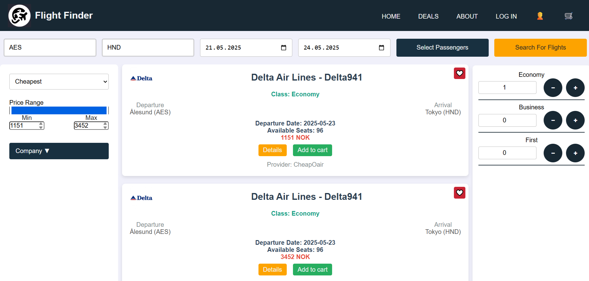
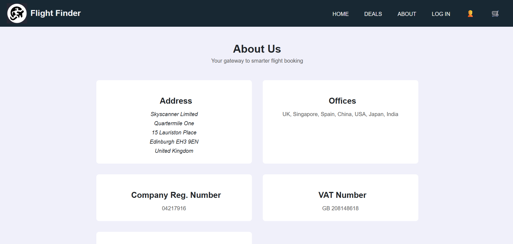
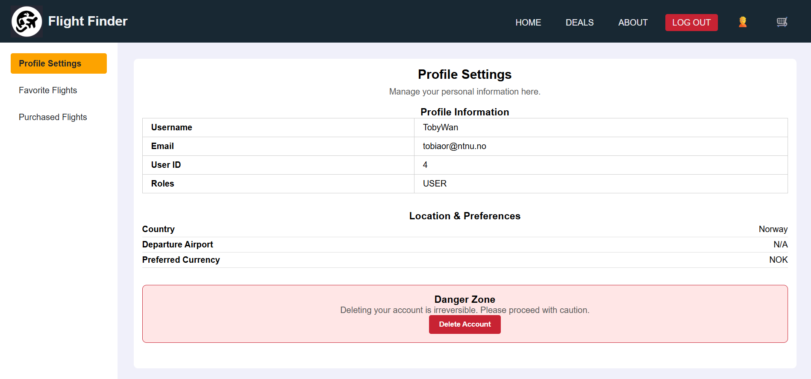
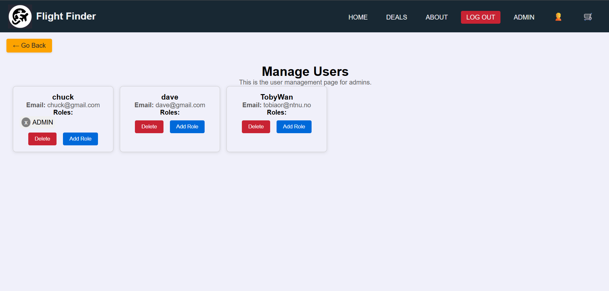
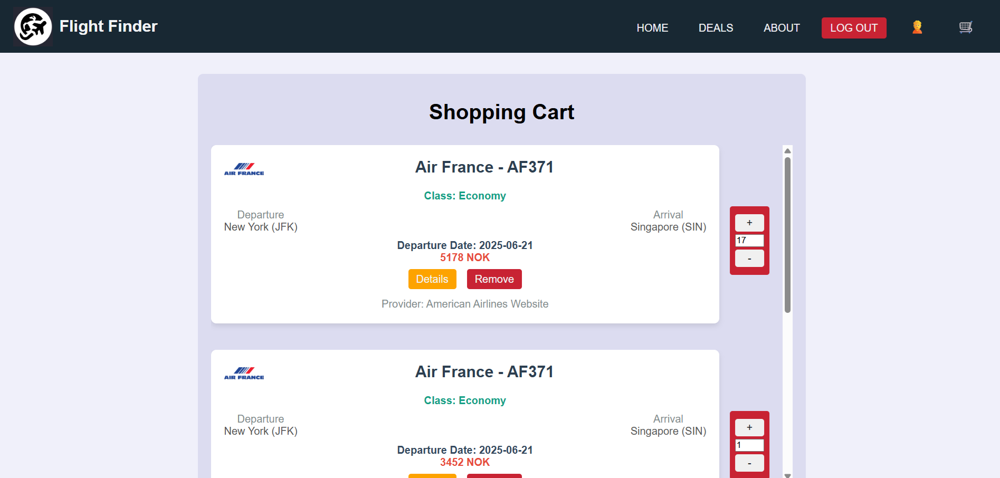

# IDATA2301_IDATA2306_GROUP_7

---

## Project Overview
This project is a full-stack web application using Spring Boot for the backend and React for the frontend. It provides a REST API for data management and a user-friendly interface for interacting with the application.

## Project Pictures

### Home page


### Deals page


### About us page


### Profile page


### Admin page
'

### Shopping cart page



---

## Project members
| Name    | GitHub-Username  |
|---------|------------------|
| Adrian  | Osterie          |
| Daniel  | Pizzaester       |
| Tobias  | TobyJavascript   |

---

## Installing dependencies

#### Installing Maven
1. Download Maven from the official website: [https://maven.apache.org/download.cgi](https://maven.apache.org/download.cgi)
2. Extract the downloaded archive and add the `bin` directory to your system's `PATH`.
3. Verify the installation by running:
   ```sh
   mvn -version
   ```

### Java (version 21 or higher)
1. Download and install Java 21 or a newer version from the official website: [https://www.oracle.com/java/technologies/javase-downloads.html](https://www.oracle.com/java/technologies/javase-downloads.html)
2. Set the `JAVA_HOME` environment variable to point to your Java installation.
3. Verify the installation by running:
   ```sh
   java -version
   ```

#### Installing Node.js and npm
1. Download and install Node.js from [https://nodejs.org/](https://nodejs.org/).
2. Verify the installation by running:
   ```sh
   node -v
   npm -v
   ```

---

## Enviroment variables

### Backend

#### Database
1. Install MySQL or on your local machine.
2. Create a new database named `flight_application`.
3. Create a user with the necessary privileges to access the database.
4. Make sure to note down the database host, username, password, and port number.
5. Make sure you run the database server.

Below are the required environment variables for the backend:

| Variable Name       | Description                                                                                    |
| ------------------- | ---------------------------------------------------------------------------------------------- |
| `DATABASE_HOST`     | Hostname or IP of the database (localhost if you run it locally)                               |
| `DATABASE_USERNAME` | Username to connect to database (if your are running locally, username to your mysql database) |
| `DATABASE_PASSWORD` | Password for the database user (if your are running locally, password to your mysql database)  |
| `DATABASE_PORT`     | Database port number (by default 3306)                                                         |
| `DATABASE_NAME`     | Name of the database (flight_application)                                                      |
| `JWT_SECRET_KEY`    | Secret key for JWT signing                                                                     |

---

## Launching project

Read the readme files for the backend and frontend for instructions on how to run the project.