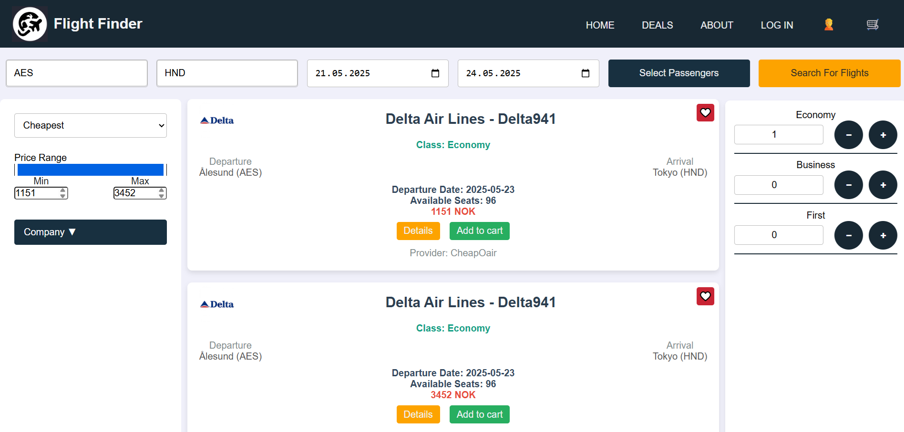
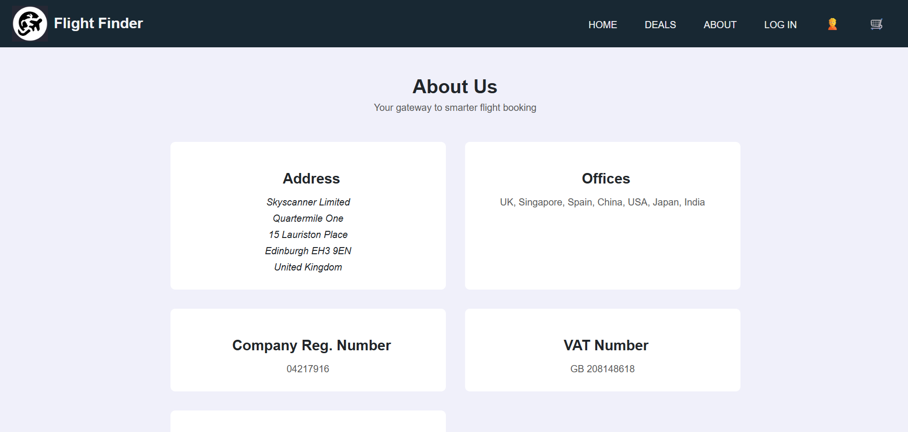
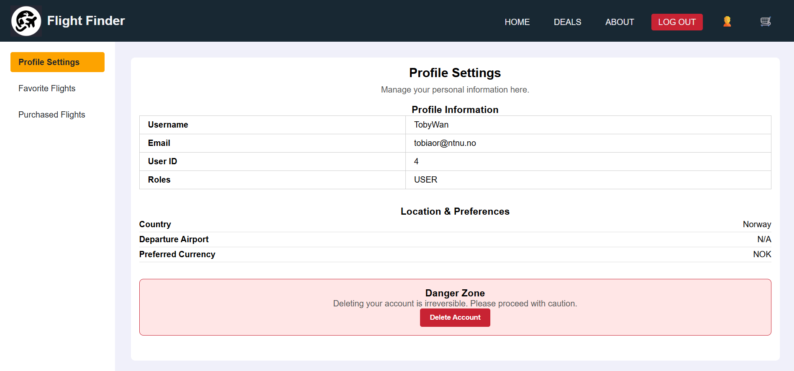
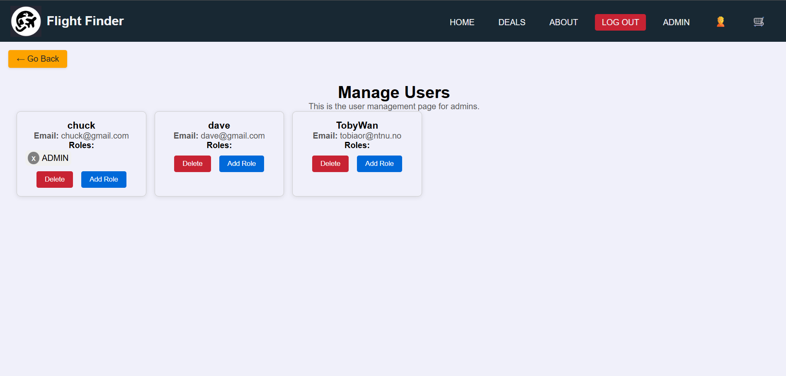
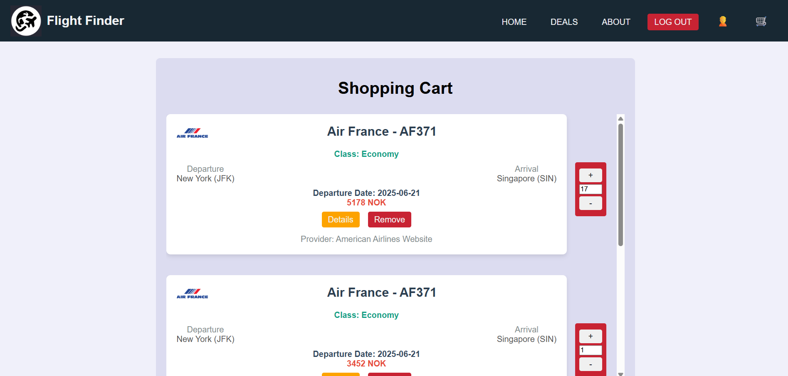

# IDATA2301_GROUP_7

---

## Project Overview
This project is a full-stack web application using Spring Boot for the backend and React for the frontend. It provides a REST API for data management and a user-friendly interface for interacting with the application.

---

## Project members
| Name    | GitHub-Username  |
|---------|------------------|
| Adrian  | Osterie          |
| Daniel  | Pizzaester       |
| Tobias  | TobyJavascript   |

---

## Project Pictures

### Home page


### Deals page


### About us page


### Profile page


### Admin page
'

### Shopping cart page


---

## Installing dependencies

#### Installing Node.js and npm
1. Download and install Node.js from [https://nodejs.org/](https://nodejs.org/).
2. Verify the installation by running:
   ```sh
   node -v
   npm -v
   ```

---

## Launching project

#### Launching React
1. Open a terminal at the **package.json** level.
2. Run the following command:
   ```sh
   npm start
   ```